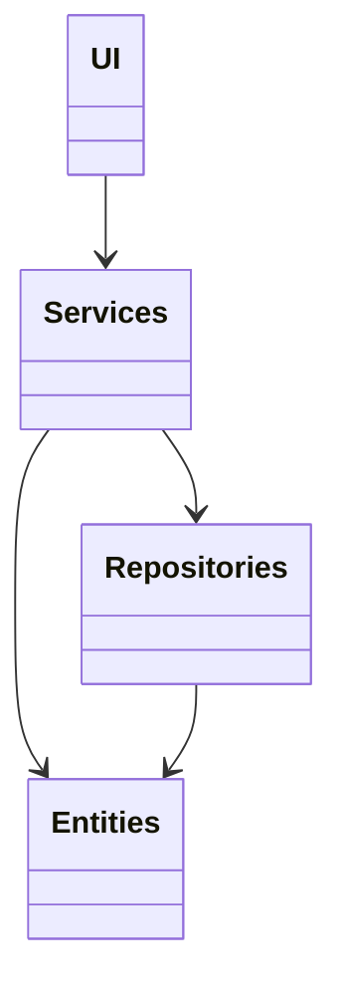

# Arkkitehtuurikuvaus

## Rakenne

Ohjelman alustava rakenne näyttää seuraavanlaiselta:

Pakkaus UI sisältää käyttöliittymän, services pelilogiikan ja repositories tietojen tallennuksesta vastaavan koodin. Entities sisältää sovelluksen tietokohteita.