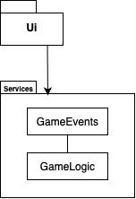
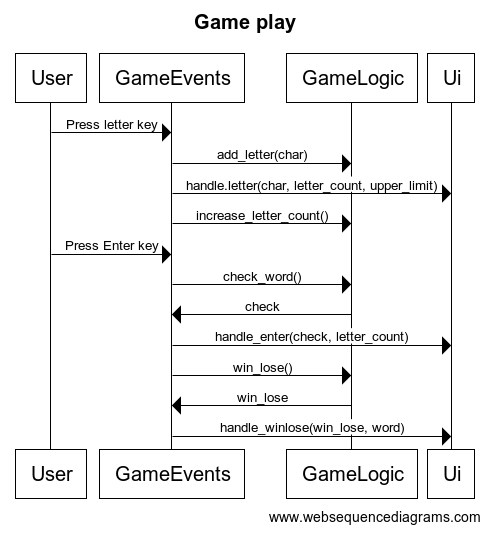
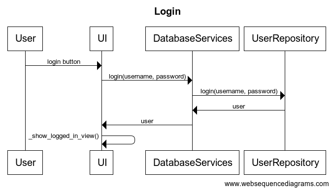
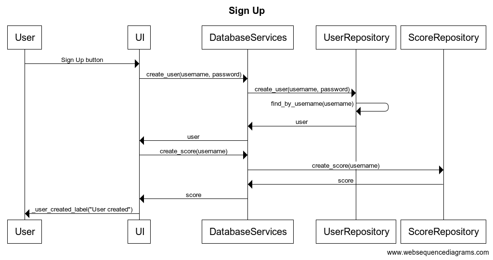

# Arkkitehtuurikuvaus

## Rakenne

Sovellus rakentuu neljästä eri pääkomponentista: entities, repositories, services ja ui.

Ui sisältää kaiken graafisen käyttöliittymän toiminnallisuuden. Services sisältää kaksi luokkaa, joista toinen käsittelee näppäimistön tapahtumia ja toinen pelilogiikkaa. Repositories sisältävät tietokantatoiminnot userdatabaseen ja scoredatabaseen. Entities sisältää sovelluksen tietomuodot User ja Score.

## Käyttöliittymä

Käyttöliittymä koostuu viidestä erillisestä näkymästä:

- Aloitusnäkymä, josta siirrytään pelaamaan, kirjautumaan tai rekisteröitymään.
- Pelinäkymä, jossa pelataan peliä ja voidaan palata valikkonäkymään back -painikkeella.
- Kirjautumisnäkymä, josta kirjaudutaan sisään.
- Rekisteröitymisnäkymä, josta rekisteröidään uusi käyttäjä.
- Kirjautumisen jälkeen näkymä, jossa näytetään käyttäjän tilastoja ja siirrytään pelaamaan.

## Sovelluslogiikka

Sovelluksen pelin toiminnallisuus toteutuu luokissa GameLogic ja GameEvents, jotka toteuttavat pelissä tapahtuvat tapahtumat. GameLogic sisältää pelin toiminnallisuuden ja GameEvents sisältää pelin tapahtumien käsittelyn. DatabaseRepository sisältää tietokantatoiminnot, jotka käsittelevät käyttäjän ja käyttäjän tilastojen tallentamista tietokantaan.

## Tietojen pysyväistallennus

Sovelluksen repositories luokat UserRepository ja ScoreRepository huolehtivat tietojen käsittelemisestä tietokantaan. Molemmat luokat tallentavat tiedot SQLite-tietokantaan. Pelissä käytettävä lista sanoista on tallennettu tiedostoon five.txt.

Molemmissa tietokannoissa on yksi taulu. User_database sisältää kolumnit username ja password. Score_database sisältää kolumnit username, games_played ja guessed_words.

## Päätoiminnallisuudet

### Pelin aloitus

Käyttäjä näkee näkymässä tyhjän ruudukon, mihin syötetään täydentyy kirjaimet sekä vihjeet seuraavalla tavalla:

Kun käyttäjä painaa kirjainta näppäimistössään kutsuu GameEvents metodia add_letter GameLogic luokasta ja handle_letter metodia käyttöliittymästä antaen parametreiksi kirjaimen, kirjainten määrän ja ylärajan kirjaimien määrälle. Tämän jälkeen GameEvents kutsuu increase_letter_count funktiota.

### Kirjautuminen

Käyttäjä kirjautuu sovellukseen kirjoittamalla käyttäjätunnuksen ja salasanan kirjautumisnäkymään. Painamalla Login -painiketta tapahtuu seuraavaa:

UI käyttää DatabaseService luokan funktiota login, joka kutsuu UserRepository luokan funktiota login. Jos käyttäjää tai salasana ei täsmää nostetaan poikkeus. Jos käyttäjä on olemassa, palauttaa UserRepository user -olion DatabaseServicelle, joka palauttaa sen UI:lle ja näkymä siirtyy kirjautuneen näkymään.

### Rekisteröityminen

Käyttäjä luo tunnuksen sovellukseen syöttämällä käyttäjätunnuksen ja salasanan käyttöliittymän kenttiin. Painamalla Sign Up -painiketta tapahtuu seuraavaa:

UI käyttää DatabaseService luokan funktiota create_user, joka kutsuu UserRepository luokan funktiota create_user. Jos käyttäjänimi tai salasana eivät täytä vaatimuksia nostetaan poikkeus. Jos käyttäjänimi on vapaana, UserRepository palauttaa DatabaseServicelle user -olion, joka palautetaan UI:lle. Tämän jälkeen UI kutsuu DatabaseService luokan funktiota create_score, joka kutsuu ScoreRepositoryn luokan funktiota create_score. ScoreRepository palauttaa DatabaseServicelle score -olion, joka palautetaan UI:lle ja UI ilmoittaa käyttäjälle onnistuneesta rekisteröitymisestä.

### Muu toiminnallisuus

Loput ohjelman toiminnallisuudesta tapahtuu samalla tavalla. Käyttöliittymän tapahtumakäsittelijä kutsuu sovelluslogiikan metodeja, jotka kutsuvat tietokantarepositorioiden metodeja. Tietokantarepositoriot kutsuvat tietokantaa ja palauttavat sovelluslogiikalle tai käyttöliittymälle tarvittavat tiedot.