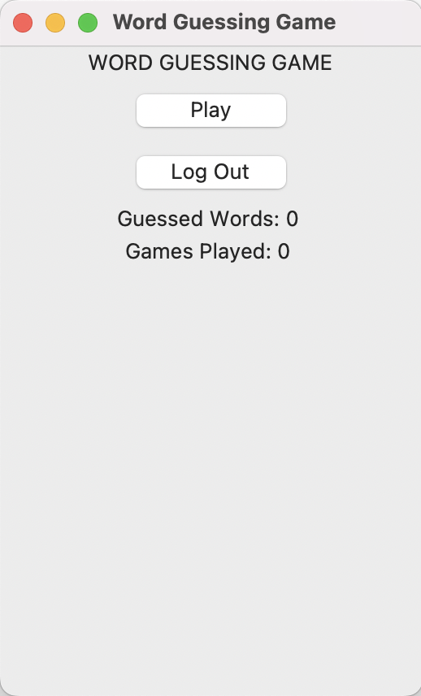

# Käyttöohje

Lataa viimeisin versio ohjelmasta repositorioon etusivulta klikkaamalla "Code" ja valitsemalla "Download ZIP"

## Konfigurointi

Tallennukseen käytettävien tiedostojen nimiä voi muokata ohjelman .env -tiedostossa:
```
USERS_FILENAME=users.db
SCORE_FILENAME=score.db
```

## Ohjelman käynnistäminen

Ennen ohjelman käynnistämistä, asenna riippuvuudet komennolla:

```
poetry install
```
Sitten suorita alustus komennolla:

```
poetry run invoke build
```
Tämän jälkeen voit käynnistää sovelluksen komennolla:

```
poetry run invoke start
```

## Aloitusnäkymä

Sovellus käynnistyy näkymään:


## Uuden käyttäjän luonti

Klikkaa Sign Up -nappia
Syötä tekstikenttiin haluamasi käyttäjätunnus ja salasana


Huom! Käyttäjätunnuksen täytyy olla vähintään kolme merkkiä pitkä. Myös salasanan täytyy olla yli kuusi merkkiä pitkä ja lisäksi:

 - Vähintään yksi iso ja pieni kirjain
 - Vähintään yksi numero

 Luo käyttäjä klikkaamalla Sign Up

Palataksesi aloitusnäkymään klikkaa back -nappia

 ## Sisäänkirjautuminen

 Klikkaa Log In -nappia siirtyäksesi kirjautumisnäkymään

 Syötä kirjautumistiedot ja klikkaa Sign In -nappia


## Sisäänkirjauksen jälkeen

Näkymän kautta voi siirtyä pelaamaan peliä tai tarkastella tilastoja.



Alareunassa näet tilastoja pelikerroista ja monesti on arvattu sana oikein.
Log out -napista pääset kirjautumaan ulos ja takaisin aloitusnäkymään.

## Pelinäkymä

Voit arvata sanaa näppäilemällä arvauksesi ruudukkoon.

Painamalla Enteriä peli tarkastaa onko sana oikein


Keltainen ruutu ilmaisee että kirjain on oikein, mutta väärällä paikalla
Vihreä ruutu ilmaisee että kirjain on oikein ja oikealla paikalla

Jos arvaat sanan oikein enintään viidellä yrityksellä, muuttuvat kaikki ruudut vihreiksi ja ruudukon alle tulee ilmoitus.
Jos sanaa ei arvata oikein, tulee ruudukon alle ilmoitus ja oikea sana.

## Lopetus

Voit sulkea ohjelman yläkulman rastista.
