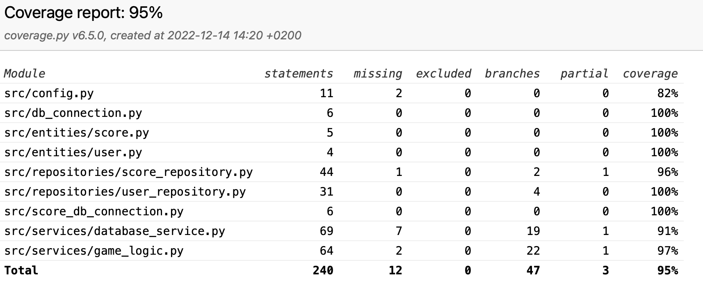

# Testausdokumentti

Ohjelmaa on testattu käsin käyttöliittymän kautta sekä automatisoidusti yksikkö- ja integraatiotesteillä. Testaus on suoritettu Pythonin unittest-kirjaston avulla.

## Yksikkö- ja integraatiotestaus

### Sovelluslogiikka

Sovelluksen tietokantalogiikasta vastaavaa DatabaseService -luokkaa testataan TestDatabaseServices -testiluokalla. Testille luodaan testaamiseen DatabaseService -luokka ja sen avulla luodaan käytättäjä testejä varten. Sovelluksella on myös pelilogiikalle oma GameLogic -luokka, jota testataan TestGameLogic -testiluokalla. Testiluokat testaa laajasti luokkien metodeja eri funktioilla.

### Repositoriot

Repositorio -luokkia UserRepository ja ScoreRepository testataan erillisissä testitiedostoissa. Kummallekin luodaan testejä varten omat tietokannat varsinaisen ohjelman tietokannoista, jotta testit eivät vaikuta varsinaiseen ohjelmaan. Näiden tietokantojen nimet ovat konfiguroitu .env.test -tiedostossa. Testitiedostot ovat TestUserRepository ja TestScoreRepository.

### Testikattavuus

Ohjelman testikattavuus on 95% kun käyttöliittymää ei lasketa mukaan.

Testaamatta jäivät build.py ja initialize_database.py -tiedostot, sillä niiden toiminnallisuus on hyvin yksinkertaista. Myös game_events.py testaus on jätetty suorittamatta, sillä kyseinen tiedosto käsittelee käyttöliittymän näppäinkometoja.

## Järjestelmätestaus

Sovelluksen järjestelmätestaus on suoritettu manuaalisesti.

## Asennus- ja konfigurointi

Sovellus on ladattu ja asennettu käyttöohjeiden mukaisesti macOS- ja Linux-ympäristössä. Sovellusta on testattu virheellisillä käyttöliittymän syötteillä ja käyttäjätiedoilla.

## Toiminnallisuudet

Kaikki määrittelydokumentin ja käyttöohjeen toiminnallisuudet on testattu. Myös virheelliset syötteet on testattu.
