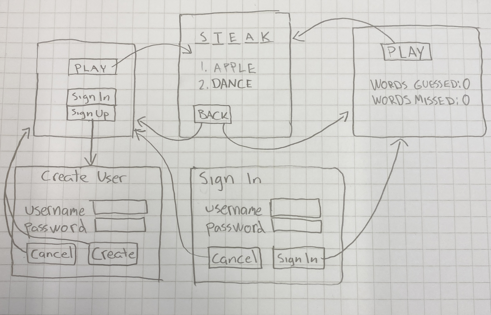

# Vaatimusmäärittely

## Sovelluksen tarkoitus

Sovellus on sanapeli, jossa pelaaja yrittää arvata annettua viisikirjaimista sanaa. Sovellukseen 
on mahdollista luoda oma käyttäjätunnus, jolloin sovellus tallentaa tilastoja pelikerroista. 

## Käyttäjät

Sovellusta voi pelata joko luomalla käyttäjätunnuksen tai ilman. Luomalla käyttäjätunnuksen 
sovellus pitää kirjaa pelatuista peleistä ja arvattujen sanojen määrästä.

## Käyttöliittymäluonnos

## Perusversion tarjoama toiminnallisuus

### Pelin toiminnallisuus

- Käyttäjä yrittää arvata annettua sanaa "tehty"
  - Viisi yritystä arvata sana
  - Jos kirjain on oikein ja oikealla paikalla, muuttuu se vihreäksi
  - Jos kirjain on oikein, mutta on väärällä paikalla, muuttuu se keltaiseksi

- Käyttäjä voi luoda järjestelmään käyttäjätunnuksen "tehty"
- Käyttäjätunnuksen tulee olla uniikki
  - Salasanan täytyy olla yli 6 merkkiä ja sisältää:
  - Vähintään yksi iso kirjain
  - Vähintään yksi numero
  
- Käyttäjä voi kirjautua sisään tunnuksella ja salasanalla "tehty"
  - Jos käyttäjätunnus tai salasana on väärin, järjestelmä ilmoittaa siitä

- Käyttäjä voi pelata peliä myös ilman kirjautumista "tehty"

### Kirjautumisen jälkeen

- Käyttäjä voi pelata peliä "tehty"
- Käyttäjän peleistä tallentuu tilastoja "tehty"
